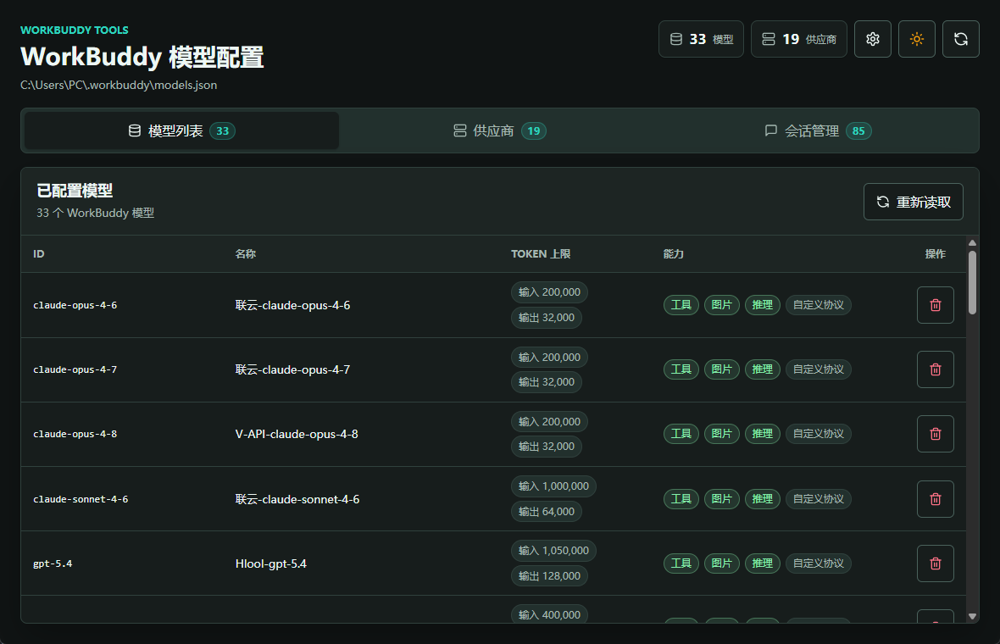
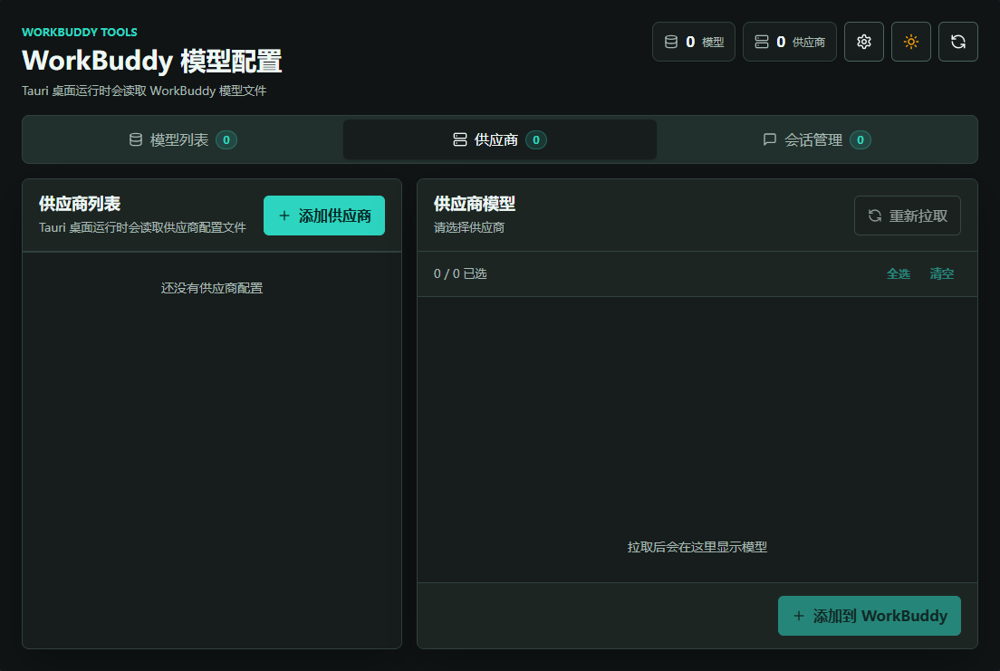
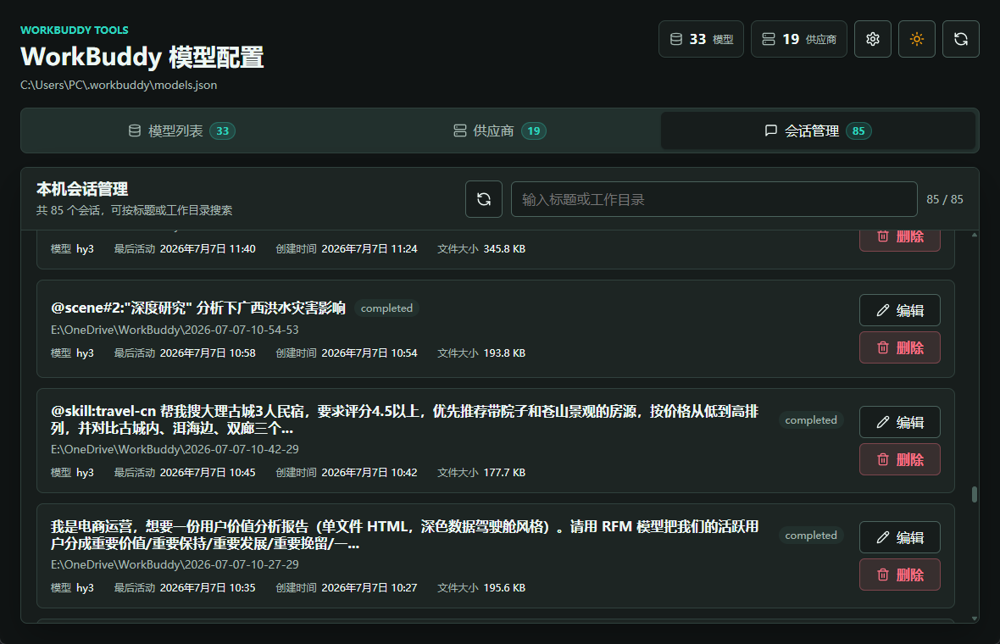
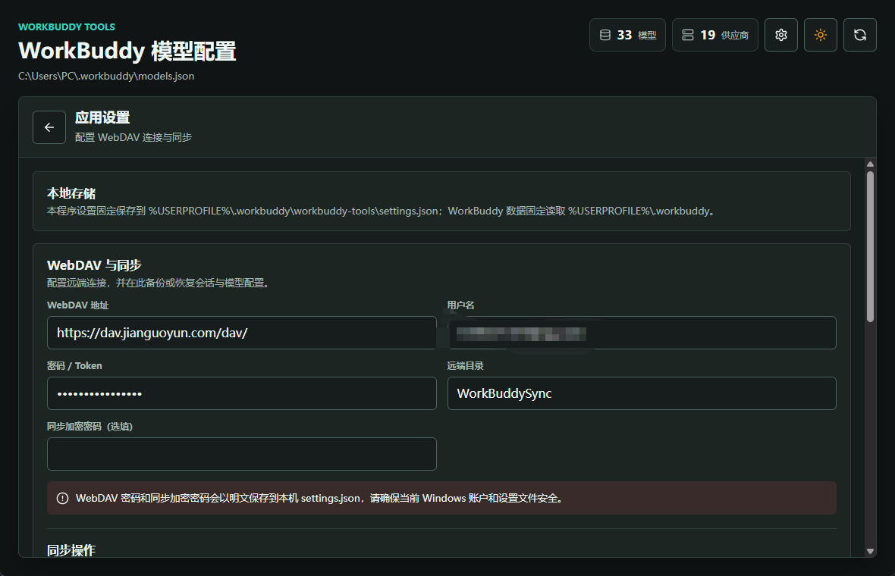

# WorkBuddy Tools

[English](README.md) | [简体中文](README.zh-CN.md)


WorkBuddy Tools is a Windows desktop companion for managing WorkBuddy model providers, local sessions, and encrypted WebDAV backups. It provides a safer UI for operations that would otherwise require editing JSON files or the WorkBuddy SQLite database by hand.

> This is an independent companion application. It does not replace WorkBuddy.

## Screenshots

### Model and provider management




### Session management



### WebDAV sync



## Features

### Models and providers

- Read models configured in `%USERPROFILE%\.workbuddy\models.json`.
- Add, update, and remove third-party OpenAI-compatible models.
- Store provider names, API endpoints, and API keys separately in `model-providers.json`.
- Fetch available models from a provider's `/v1/models` endpoint.
- Infer tool calling, image input, reasoning, and custom protocol capabilities.
- Fill input and output token limits from provider metadata or the built-in model database.
- Back up `models.json` before changing it.

### Sessions

- Read active sessions directly from the `sessions` table in `%USERPROFILE%\.workbuddy\workbuddy.db`.
- Search sessions by title or working directory.
- Display the model recorded in `sessions.model`.
- Edit a session name (`custom_title`) and working directory (`cwd`).
- Move inactive sessions to the WorkBuddy recycle bin.
- Protect running sessions from editing or deletion.

### WebDAV sync

- Sync WorkBuddy session metadata, project JSONL files, models, and provider settings as one ZIP package.
- Choose smart merge, remote overwrite, or local overwrite.
- Optionally encrypt the package with a dedicated sync passphrase.
- Create a local backup before a remote overwrite.
- Preserve local API keys during smart merge when appropriate.
- Repair workspace paths when devices use different default workspace roots.

During session sync, the remote and local `defaultWorkspacePath` values are compared. The local value is read from:

```text
%USERPROFILE%\.workbuddy\app\app-config.json
```

If the roots differ, imported values in `sessions.cwd` and `workspaces.path` are rewritten to use the local root. For example:

```text
D:\OneDrive\WorkBuddy\WorkSpace\project-a
->
E:\OneDrive\WorkBuddy\WorkSpace\project-a
```

`app-config.json` itself is not uploaded. Only the default workspace path required for this comparison is included in the exported session metadata.

## Synced Data

| Data | Included | Notes |
| --- | --- | --- |
| Session metadata | Yes | Exported from `workbuddy.db`; the database file itself is not uploaded |
| Project conversations | Yes | `%USERPROFILE%\.workbuddy\projects\**\*.jsonl` |
| Models | Yes | `models.json` |
| Provider settings | Yes | `model-providers.json`, which may contain API keys |
| Default workspace path | Metadata only | Used for path repair; `app-config.json` is not uploaded |
| Runtime files | No | PID sidecars, caches, logs, SQLite WAL and SHM files are excluded |

The remote package is named `workbuddy-sync.zip.enc` when encryption is enabled, or `workbuddy-sync.zip` when no passphrase is configured. An unencrypted package can expose conversations, model configuration, and API keys to the WebDAV server; encryption is strongly recommended.

## Configuration Files

WorkBuddy data is read from `%USERPROFILE%\.workbuddy`:

```text
%USERPROFILE%\.workbuddy\
├── app\app-config.json
├── projects\
├── model-providers.json
├── models.json
└── workbuddy.db
```

WorkBuddy Tools stores its own settings at:

```text
%USERPROFILE%\.workbuddy\workbuddy-tools\settings.json
```

WebDAV credentials and the optional sync passphrase are currently stored as plain text in this local settings file. Protect it with appropriate Windows account and filesystem permissions.

## Requirements

- Windows
- WorkBuddy with data in `%USERPROFILE%\.workbuddy`
- Node.js and npm for development
- Rust and Cargo for development
- WebView2 Runtime
- An OpenAI-compatible provider for custom model management

Providers should support at least:

```text
GET /v1/models
POST /v1/chat/completions
```

## Development

Install dependencies and start the Tauri application:

```powershell
npm install
npm run tauri dev
```

Useful checks:

```powershell
npm run typecheck
npm run test:layout
npm run test:provider-workflow
npm run test:runtime
npm run test:theme
cargo test --manifest-path src-tauri/Cargo.toml --lib
npm run build
```

Build the release executable without an installer bundle:

```powershell
npm run tauri build -- --no-bundle
```

## Application Updates

The app checks GitHub Releases after startup, shows an update indicator in the header, and installs signed updates from “Application Settings → About & Updates”. Before publishing a `v*` tag, configure these GitHub Actions secrets:

- `TAURI_SIGNING_PRIVATE_KEY`: the Tauri updater private key paired with the public key in `src-tauri/tauri.conf.json`.
- `TAURI_SIGNING_PRIVATE_KEY_PASSWORD`: the private-key password; leave empty for an unencrypted key.

Keep the versions in `package.json`, `src-tauri/Cargo.toml`, `src-tauri/tauri.conf.json`, and `VERSION` synchronized before publishing. The release workflow generates signed updater artifacts and `latest.json`. Back up the private key securely: existing installations cannot verify updates signed with a replacement key.

## Tech Stack

- Tauri 2
- Rust and SQLite
- React 18 and TypeScript
- Vite

## Privacy

- Provider API keys are stored locally in `model-providers.json`.
- Synced provider settings may contain API keys.
- Session sync packages contain conversation data.
- Use a strong, separate sync passphrase and keep it available on every device that needs to decrypt the backup.
- Model capabilities and token limits may be inferred; verify them against the provider's current documentation when exact limits matter.
